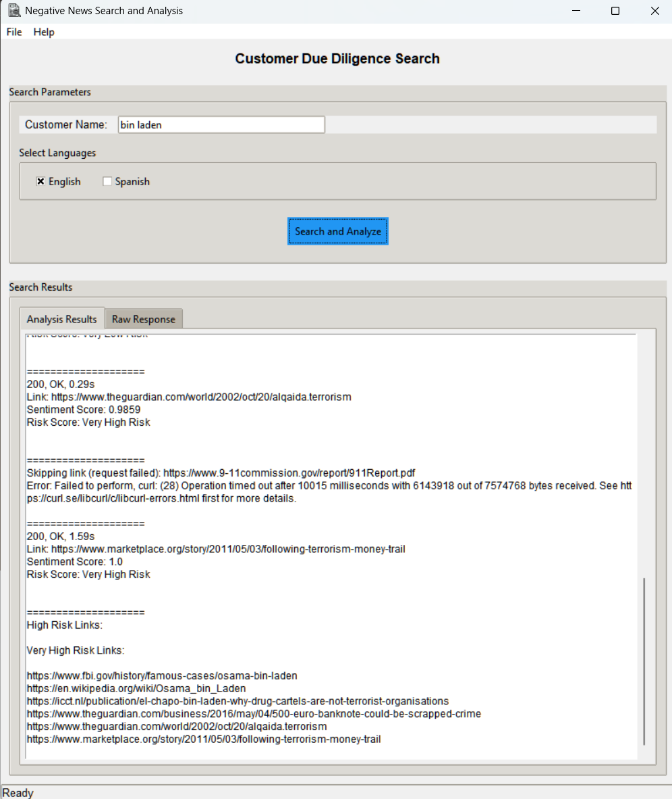

# Negative News Search and Analysis Tool - NNSAT



A Python-based GUI application that searches for and analyzes potential negative news about customers using Google Custom Search API and sentiment analysis. 

## Features

- Custom Google search with specified keywords
- `Multi-language` and `custom search keywords` support
- Configurable languages, keywords, exclusions and more using json based config
- Sentiment analysis of search results
- Risk `scoring` and `categorization` based on `Sentiment scores` for each result
- Interactive GUI with Raw JSON response viewer
- Automatic browser opening for high-risk results
- Uses `Curl CFFI` for access to all kinds of URLs
- Support Parsing of PDF and DOCx files in URLs


## Prerequisites

- Python 3.x
- Google Custom Search API credentials
- Internet connection

## Prebuilt Windows Binary (With our provided search API Keys and CX)
- [Binary Release]()
- Make sure config.json is in application root

## Installation

1. Clone the repository
   ```bash
   git clone https://github.com/aamitn/negative-news
   ```
2. Install required dependencies:
   ```bash
   pip install -r requirements.txt
   ```
3. Set up Google Custom Search API:
   1. Create Custom Search Engine:
      - Visit [CSE Creation Page](https://cse.google.com/cse/create/new) or [Programmable Search Engine](https://programmablesearchengine.google.com/controlpanel/create)
      - Create your search engine
      - Note down the CX/Search engine ID
   
   2. Get API Key (choose one method):
      - Method A:
        1. Go to [Custom Search API Overview](https://developers.google.com/custom-search/v1/overview)
        2. Click "Get a Key"
      - Method B:
        1. Visit [Google Cloud Console](http://console.cloud.google.com/apis/library/customsearch.googleapis.com)
        2. Enable Custom Search API
        3. Go to [Credentials](http://console.cloud.google.com/apis/credentials)
        4. Click "CREATE CREDENTIALS"
        5. Select "API key"
        6. Copy your API key
   
4. Configure Application:
      - Create `config.json` in project root
      - Add your API credentials creted in step 3

## Configuration

Create a `config.json` file in the project root with the following structure:

```json
{
    "google_search_api_key": "YOUR_GOOGLE_SEARCH_API_KEY",
    "google_search_cx": "YOUR_GOOGLE_CUSTOM_SEARCH_CX",   

    "pdf_max_pages": 5,
    "docx_max_paragraphs" : 50,
    "max_chars" : 1000,

    "total_results": 10,

    "connection_timeout":5,
    "read_timeout": 5,
    "max_retries": 2,
    
    "curl_cffi_impersonator": "chrome",

    "languages_keywords": {
        "English": ["bribery", "fraud", "money laundering", "crime", "terrorism", "corruption"],
        "Spanish": ["soborno", "fraude", "lavado de dinero", "crimen", "terrorismo", "corrupción"],
        "yourlang":["custom_key1","key2"]
    },

    "default_selected_languages": ["English"],

    "excluded_sites": ["facebook.*", "twitter.*", "instagram.*", "linkedin.*", "reddit.*"]
}
```

## Usage

1. Run the application:
```bash
python app.py
```

2. Enter the customer name in the search field
3. Select the desired languages for search
4. Click "Search and Analyze"
5. View results in the Analysis Results tab
6. Check raw API responses in the Raw Response tab


## Generate Executable with pyinstaller

```bash
pyinstaller --noconfirm --onefile --windowed --icon "C:\Users\bigwiz\PycharmProjects\negative-news\assets\logo.ico"  "C:\Users\bigwiz\PycharmProjects\negative-news\app.py"
```

## Troubleshooting

- SSL Certificate issues: The application uses a local `cacert.pem` file for SSL verification
- If you encounter connection issues, check your internet connection and API credentials
- Ensure all required Python packages are installed correctly
